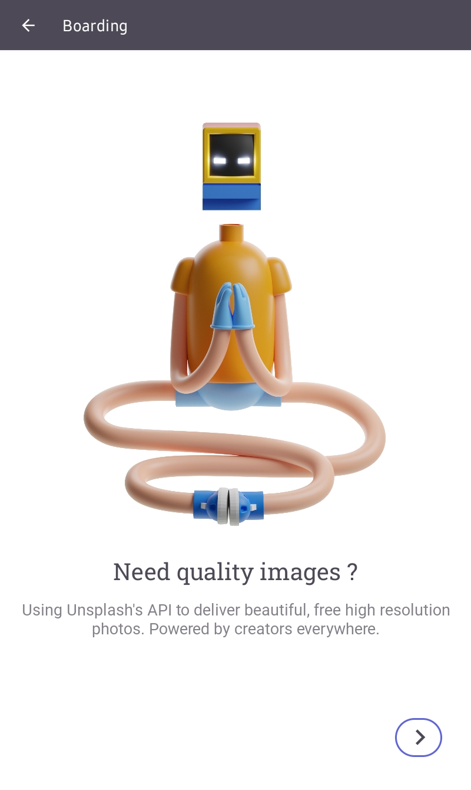
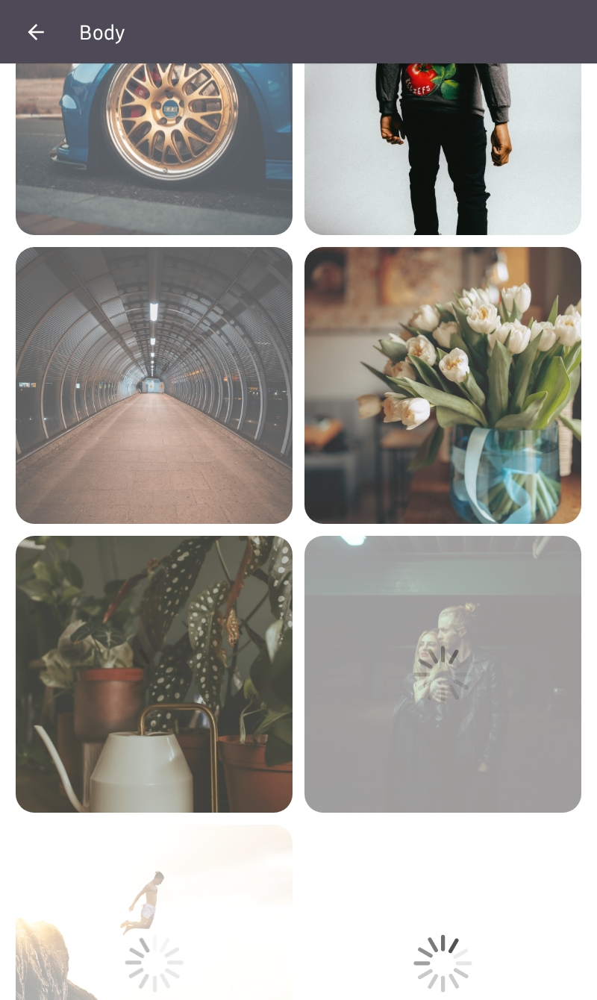

# Splash
Wanted an app that displays images from Unsplash, well here it is
## Description 
- Made a request for a list of images from [Unsplash](https://unsplash.com/) 
- Used [Coil](https://coil-kt.github.io/coil/getting_started/) to load up the images
- Display it in a grid view, using basic animations (crossfade) and a loading animation 

## Download
Download the app [Splash](https://github.com/Bamidele1234/Splash/raw/master/Splash.apk)

## Note 
**This personal project was done after completion of Unit 4: Connect to the Internet, Android Basics in Kotlin** 
## Screenshots 
**Welcome Page**
-- 

**Boarding Page**
-- 

**Body Page(Connected)**
--

**Body Page(loading)**
--

**Body Page(Disconnected)**
--

